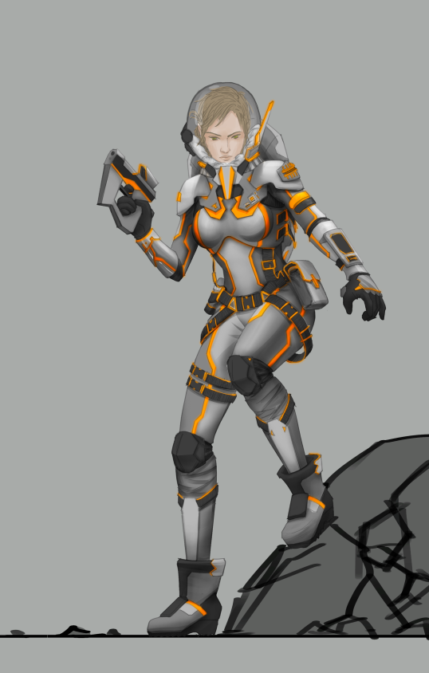
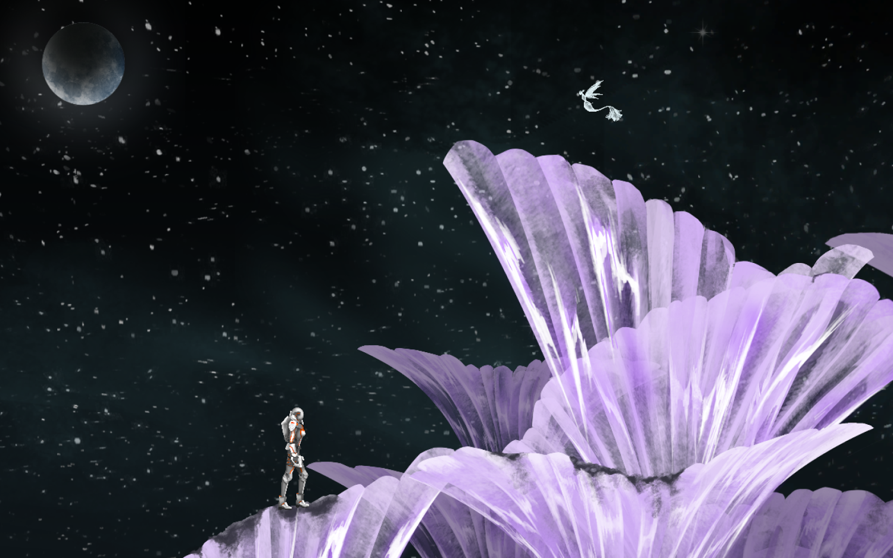
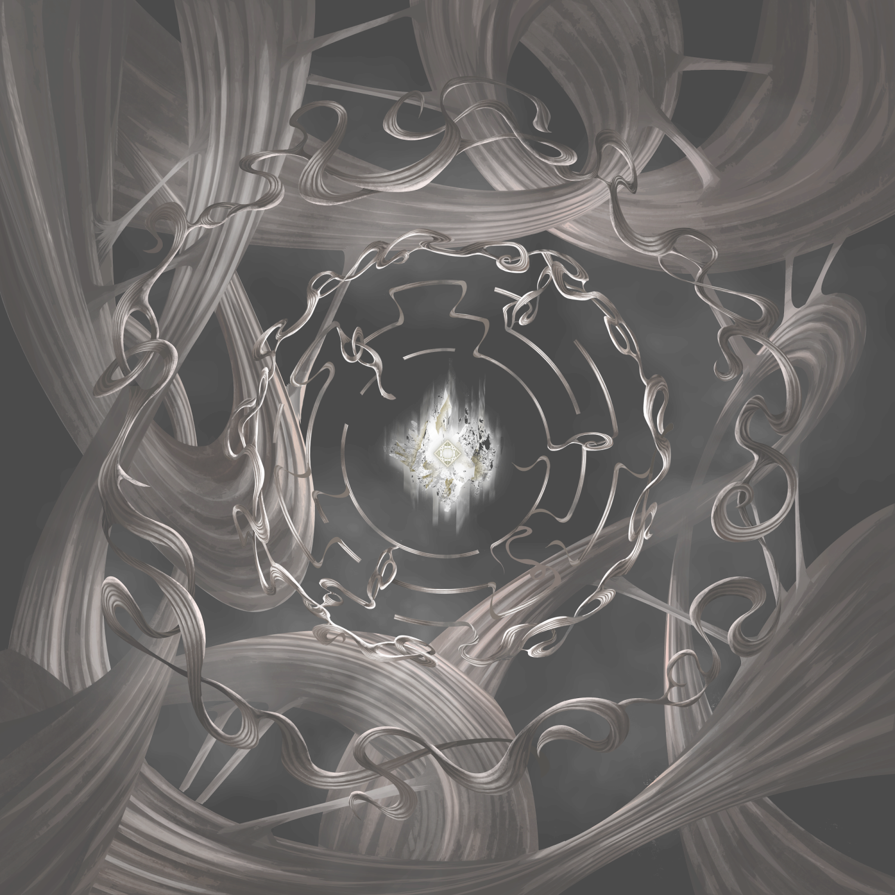

# Exclir-Adventure-Game
RE is a 2D platformer adventure game which allows two players share screen. The narrative of the game is a human astronaut exploring this planet called RE with an alien. The estimated walkthrough time is 30 minutes.

RE consists of 4 levels, including the tutorial level, Ice Cave, Crystal Land and Planet Core. All 4 levels have different focus, including fighting against enemy AI, going through traps and cooperation between two players.

The game is written in C# using Unity engine, with all artwork created by my colleague Dora Han using Photoshop. 

 

